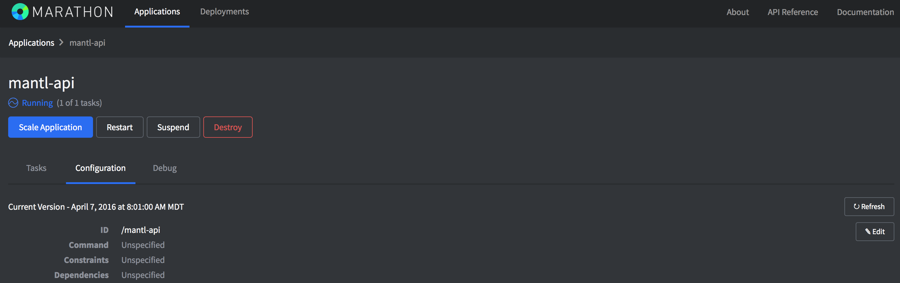
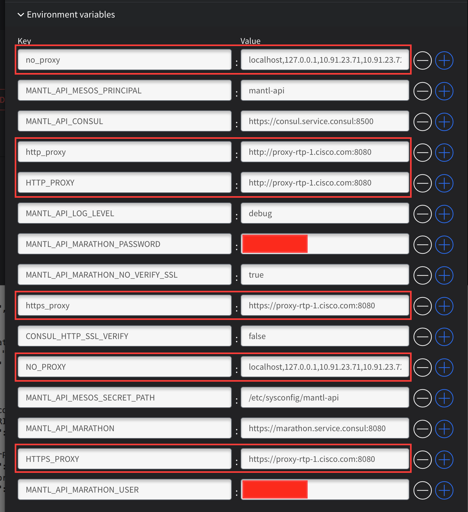

#Preparing your Template for Proxy Server Use

These steps will prepare your CentOS Template for if a Proxy server is needed in the lab.  In this section, as well as in later areas in these instructions referring to proxy settings, you may need to add additional domains to your "no_proxy" list.  If there are local resources (i.e. docker registries, code repositories, etc) that do NOT go through proxy hosted on a domain, add the needed entries to the no_proxy list.  For example, within Cisco Labs, we often need to include ".cisco.com" in the no_proxy list.

* Update .bash_profile
  * `vim ~/.bash_profile`
  * Add the following lines to the profile
    * **(be sure to add either the IP or FQDN of your vCenter Server to the no_proxy list)**
    * **(be sure to use your chosen Traefik Domain in the no_proxy list, and proceed with a '.'.)**
      * **ie .mantl.domain.com**
    * **(be sure to include .consul in the no_proxy list to exclude local service lookups)**
    * `http_proxy=http://<PROXY-SERVER>:<PROXY-PORT>`
    * `https_proxy=https://<PROXY-SERVER>:<PROXY-PORT>`
    * `export no_proxy=localhost,127.0.0.1,<VCENTER_IP_OR_FQDN>,.<traefik.domain>,.consul`
    * `export http_proxy`
    * `export https_proxy`
  * Apply the proxy changes
    * `source ~/.bash_profile`

* Update yum to use a proxy
  * `vim /etc/yum.conf`
  * Add the following lines to the profile
    * `proxy=http://<PROXY-SERVER>:<PROXY-PORT>`
  * Apply the proxy changes
    * `yum clean all`

* Prepare for Docker Proxy Needs
  * Create a folder for Docker Drop-In
    * `mkdir /etc/systemd/system/docker.service.d`
* Configure the proxy drop-in
  * `vim /etc/systemd/system/docker.service.d/http-proxy.conf`
* Add These Lines
  * `[Service]`
  * `Environment="HTTP_PROXY=http://<PROXY-SERVER>:<PROXY-PORT>/"`
  * If you will be pulling docker containers from both public repos (needing a proxy server) and private repos (where you don't need a proxy server), you'll also need to add this line
  * `Environment="localhost,127.0.0.1,<VCENTER_IP_OR_FQDN>,.<traefik.domain>,.consul"`

# Mantl Ansible Playbook Changes for Proxy Support
With Ansible 1.9.4 there is a bug in some of the modules not respecting the proxy settings configured in the environment.  Make these changes in order to have a successful deployment with proxy servers.

* Kubernetes Setup
  * `vim roles/kubernetes-master/tasks/main.yml`
  * Under "- name: download kubernetes binaries "
    * Add an environment section directly below the name
    * Modify the "get_url" options to allow unvalidated certificates
    * The start of this task should look like this

```
- name: download kubernetes binaries
  environment:
    http_proxy: http://<PROXY-SERVER>:<PROXY-PORT>
    https_proxy: https://<PROXY-SERVER>:<PROXY-PORT>
  sudo: yes
   get_url:
     validate_certs: no
     url: "{{ kube_url }}/{{ item }}"
```

* Collectd Setup
  * `vim roles/collectd/tasks/main.yml`
  * Add an environment section directly under "- name:  install collectd docker plugin dependencies" so that it looks like this

```
- name:  install collectd docker plugin dependencies
  environment:
    http_proxy: http://<PROXY-SERVER>:<PROXY-PORT>
    https_proxy: https://<PROXY-SERVER>:<PROXY-PORT>
  sudo: yes
```

# Mantl-API
Much of the time, you will interact directly with the underlying services in Mantl, such as Marathon and through their interfaces or APIs.  For some tasks, and likely a growing list in the future, you will go through the Mantl API itself.  In Marathon there is an application called "mantl-api" that was deployed at initial installation.  I've found that the application deploys, but when behind a proxy it never comes up healthy.  After some digging, I found that this was due to the API container needing to access the internet and needing to have proxy settings configured on the application.  This could be done by updating the ansible playbooks to add the proxy settings, but it is easier to just manually update the Environment variables on the application in Marathon.

To do this, log into Marathon, select "mantl-api" from the list, and click on "Configuration".  This image shows this part of the interface.



Click the "Edit" button to edit the application configuration.  Scroll down and expand out "Environment Variables".  You'll find several already listed, and you'll need to add 6 new ones as shown in the image.



You are adding the same 3 environment variables and values that you've added in other areas for proxy configuration, but we add both UPPER and lower case versions of them to make sure to cover all possible application needs.  For convenience, the list is:
* HTTP_PROXY
* HTTPS_PROXY
* NO_PROXY
* http_proxy
* https_proxy
* no_proxy

**One potential difference from your standard "no_proxy" list, is you will need to add ".consul" to the list to allow "mantl-api" to communicate with the different APIs in Mantl.**

# ELK Stack Add-on
The ELK Stack Add-On (Elastisearch, Kibana, Logstash) is a popular method for logging and analytics in the cluster.  In order to successfully deploy, you will need to edit one of the ansible role definitions.

* Edit "roles/elk/tasks/main.yml b/roles/elk/tasks/main.yml"
* In the task "name: update mantl-universe repository"
  * Edit the line "shell: docker run --rm --net=host -it {{ mantl_api_image }}:{{ mantl_api_image_tag}} sync"
    * Change to `"shell: docker run --rm --net=host -it -e "HTTP_PROXY=http://<PROXY-SERVER>:<PROXY-PORT>" -e "HTTP_PROXYS=<PROXY-SERVER>:<PROXY-PORT>" -e "http_proxy=http://<PROXY-SERVER>:<PROXY-PORT>" -e "https_proxy=https://<PROXY-SERVER>:<PROXY-PORT>" ciscocloud/mantl-api:0.1.8 sync"`
Here is an excerpt from that file on my deployment.

```
- name: update mantl-universe repository
  sudo: yes
  shell: docker run --rm --net=host -it -e "HTTP_PROXY=http://<PROXY-SERVER>:<PROXY-PORT>" -e "HTTP_PROXYS=https://<PROXY-SERVER>:<PROXY-PORT>" -e "http_proxy=http://<PROXY-SERVER>:<PROXY-PORT>" -e "https_proxy=https://<PROXY-SERVER>:<PROXY-PORT>" {{ mantl_api_image }}:{{ mantl_api_image_tag}} sync
  run_once: yes
  tags:
    - elk
```

